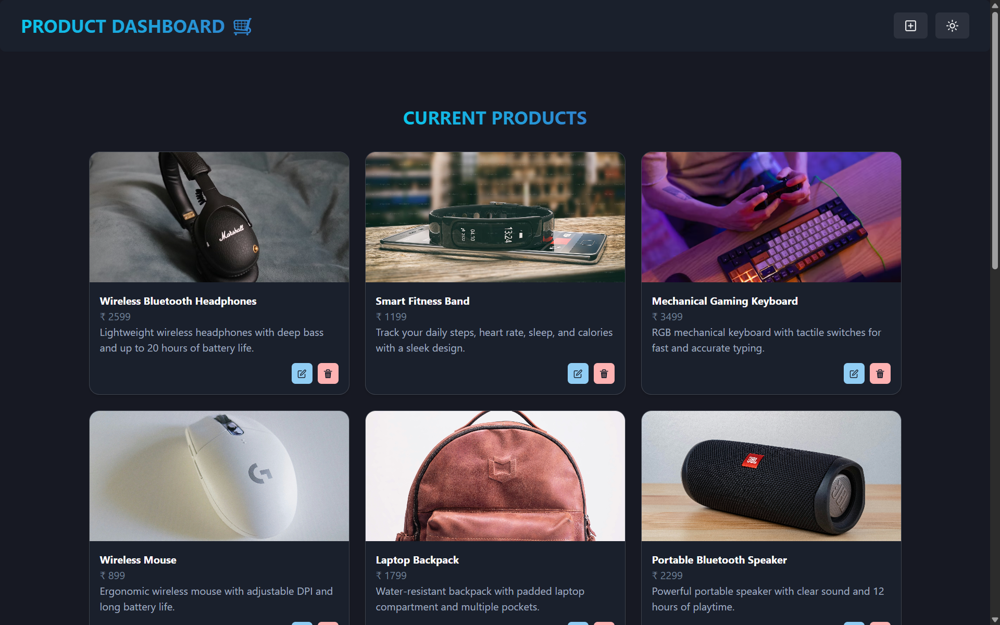
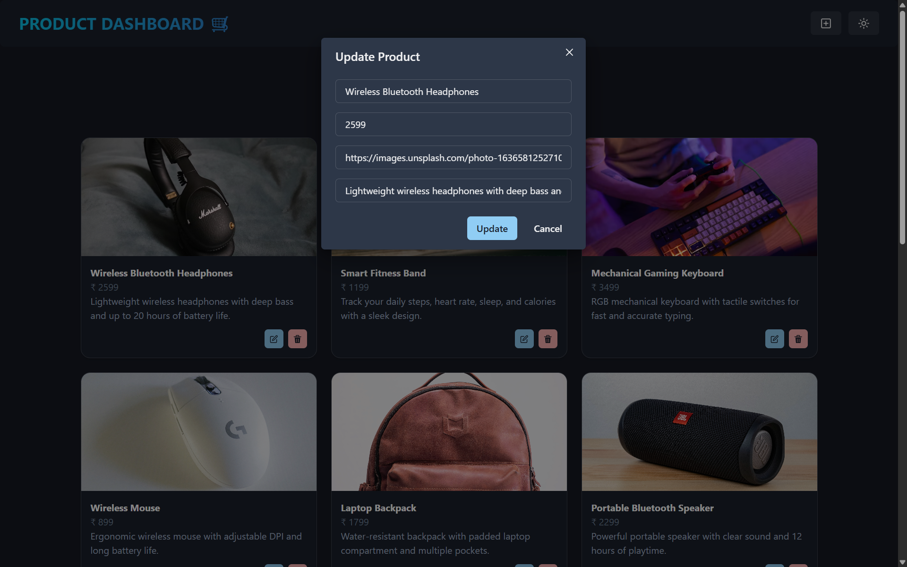
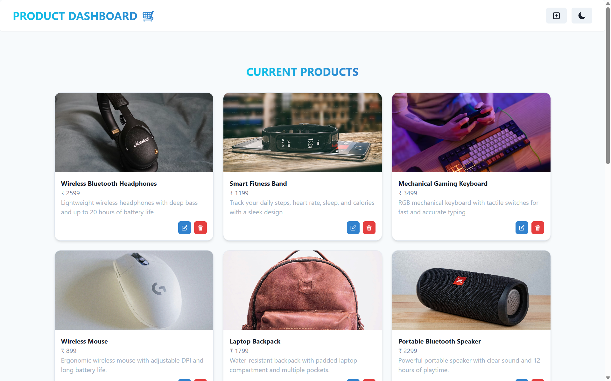

# 🛍️ MERN Product Dashboard

A full-stack product management application built with MongoDB, Express.js, React, and Node.js. Create, view, update, and delete products with a modern, responsive interface.

## 🚀 Live Demo

[](https://mern-product-dashboard.onrender.com/)

## ✨ Features

- Create new products with name, price, and image
- View all products in a responsive grid
- Update existing product details
- Delete products from the database
- Dark/Light mode toggle
- Real-time UI updates
- Fully responsive design

## 🛠️ Tech Stack

**Frontend:** React, Chakra UI, Zustand, Vite

**Backend:** Node.js, Express.js, MongoDB, Mongoose

## 📦 Installation & Setup

1. **Clone the repository**
```bash
git clone https://github.com/satyamgagre/mern-product-dashboard.git
cd mern-product-dashboard
```

2. **Install dependencies**
```bash
npm install
cd backend && npm install
cd ../frontend && npm install
```

3. **Setup environment variables**

Create a `.env` file in the root directory:
```env
MONGO_URI=your_mongodb_connection_string
PORT=5000
```

4. **Run the application**
```bash
npm run dev
```

The app will run on `http://localhost:5000`

## 📸 Screenshots

### Home Page


### Create Product Page


### Update Product


### Dark & Light Mode



### Mobile View


---

Made by [Satyam Gagre](https://github.com/satyamgagre)
